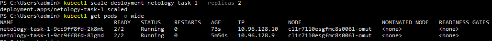
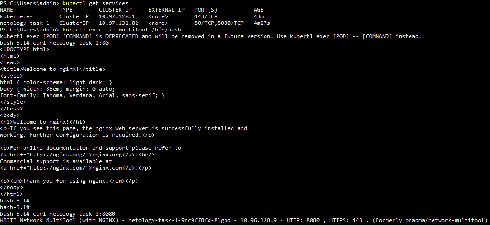

# Домашнее задание к занятию «Запуск приложений в K8S» Соловьев Д.В.
1. [Deployment manifest файл](./kubernetes%20manifests/deployment.yaml)  
   Deployment запущен:  
     
   Количество реплик увеличено до 2-х:  
     
   [Service manifest файл](./kubernetes%20manifests/service.yml)  
   Выполнение curl из дополнительного пода:  
     
2. [Deployment manifest файл](./kubernetes%20manifests/deployment%202.yaml)  
   Не стартующий из-за init контейнера nginx:  
     
   [Service manifest файл](./kubernetes%20manifests/service%202.yml)  
   Запущенный сервис и стартовавший после этого nginx:  
   